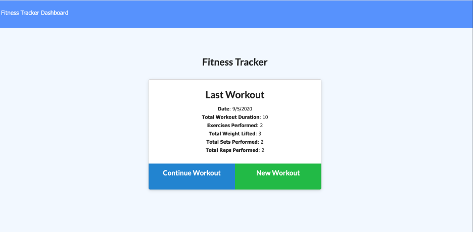

# Nosql-Workout-Tracker

[Webpage Heroku](https://nosqlworkout-tracker.herokuapp.com/)

This app Workout Tracker is built with Express and connected with Mongo database with a Mongoose schema.
When user loads the page, they are given the option to create a new workout, or continue with their last workout.

The user is able to:

  * Add exercises to a previous workout plan.

  * Add new exercises to a new workout plan.

  * View multiple the combined weight of multiple exercises on the `stats` page.

## User Story

* As a user, I want to be able to view create and track daily workouts. I want to be able to log multiple exercises in a workout on a given day. I should also be able to track the name, type, weight, sets, reps, and duration of exercise. If the exercise is a cardio exercise, I should be able to track my distance traveled.

## Business Context

A consumer will reach their fitness goals quicker when they track their workout progress.
